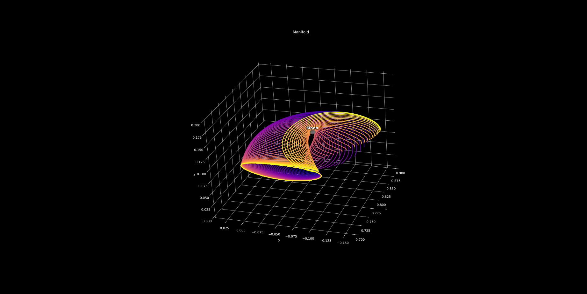
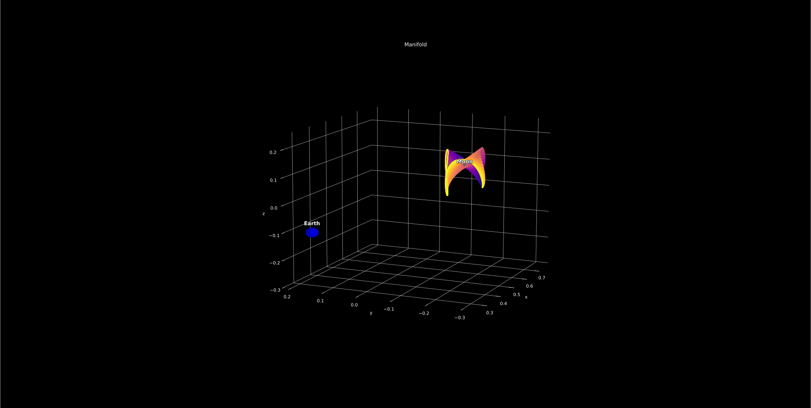

# HITEN - Computational Toolkit for the Circular Restricted Three-Body Problem

[](https://pypi.org/project/hiten/)

## Overview

**HITEN** is a research-oriented Python library that provides an extensible implementation of high-order analytical and numerical techniques for the circular restricted three-body problem (CR3BP).

## Examples

1. **High-order parameterisation of periodic orbits and their invariant manifolds**

   The toolkit constructs periodic solutions such as halo orbits and obtains polynomial representations of their stable and unstable manifolds. This enables fast, mesh-free evaluation of trajectories seeded on these structures.

   ```python
   from hiten import System

   system = System.from_bodies("earth", "moon")
   libration_point = system.get_libration_point(1)

   orbit = libration_point.create_orbit("halo", amplitude_z=0.2, zenith="southern")
   orbit.differential_correction(max_attempts=25)
   orbit.propagate(steps=1000)

   manifold = orbit.manifold(stable=True, direction="positive")
   manifold.compute()
   manifold.plot()
   ```

   

   *Figure&nbsp;1 - Stable manifold of an Earth-Moon \(L_1\) halo orbit.*

2. **Computation of Lyapunov families and associated transport pathways**

   Built-in continuation routines retrieve vertical Lyapunov orbits of varying amplitudes. Their invariant manifolds reveal natural transport channels that can be exploited for low-energy mission design.

   ```python
   from hiten import System, VerticalLyapunovOrbit

   system = System.from_bodies("earth", "moon")
   libration_point = system.get_libration_point(1)

   cm = libration_point.get_center_manifold(max_degree=10)
   cm.compute()

   initial_state = cm.ic(poincare_point=[0.0, 0.0], energy=0.6, section_coord="q3")

   orbit = VerticalLyapunovOrbit(libration_point, initial_state=initial_state)
   orbit.differential_correction(max_attempts=100)
   orbit.propagate(steps=1000)

   manifold = orbit.manifold(stable=True, direction="positive")
   manifold.compute()
   manifold.plot()
   ```

   

   *Figure&nbsp;2 - Stable manifold of an Earth-Moon \(L_1\) vertical Lyapunov orbit.*
